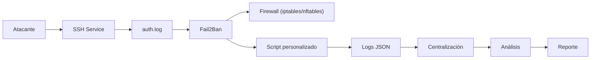

# 🔥 Fail2Ban Mini SOC · Defensa activa + automatización en Linux


Implementación de un sistema de **detección, respuesta y análisis de ataques** basado en Fail2Ban + scripting en Bash.

---

## 📌 Descripción del Proyecto

**Tipo de proyecto:** Laboratorio de ciberseguridad (Blue Team / SOC)  
**Stack:** Linux · Fail2Ban · Bash · jq · syslog · awk · Hydra  
**Objetivo:** Detectar, bloquear y analizar ataques de fuerza bruta en SSH, evolucionando hacia un mini-SOC automatizado  
**Entorno:** Laboratorio controlado (simulación de ataques reales)

---

## 🧠 Arquitectura



### 🔁 Flujo real

- Ataque → intentos fallidos en `auth.log`
- Fail2Ban detecta → aplica ban
- Script se ejecuta → genera logs estructurados
- Eventos se analizan → se genera reporte

---

## ⚙️ Funcionalidades

- 🔐 Protección activa contra brute force (SSH)
- 🚫 Bloqueo automático de IPs
- ⚡ Ejecución de acciones personalizadas (actions)
- 📊 Logs estructurados en JSON (SIEM-ready)
- 🧠 Clasificación de severidad (MEDIUM / HIGH / CRITICAL)
- 📂 Centralización de logs
- 📈 Detección de patrones de ataque
- 📝 Generación automática de informes

---

## 📂 Estructura del proyecto

```
fail2ban-mini-soc/
│
├── docs/
│   └── fail2ban-lab.pdf
│
├── scripts/
│   ├── f2b-alert.sh
│   ├── centralize_logs.sh
│   ├── realtime_monitor.sh
│   ├── report.sh
│
├── config/
│   ├── jail.local
│   └── custom-script.conf

```

---

## 🚀 Onboarding rápido

```bash
# Clonar repo
git clone https://github.com/TU_USUARIO/fail2ban-mini-soc.git
cd fail2ban-mini-soc

# Instalar Fail2Ban
sudo apt update && sudo apt install fail2ban -y

# Copiar configuración
sudo cp config/jail.local /etc/fail2ban/jail.local
sudo cp config/custom-script.conf /etc/fail2ban/action.d/

# Dar permisos a scripts
chmod +x scripts/*.sh

# Reiniciar servicio
sudo systemctl restart fail2ban
```

---

## 📜 Scripts del proyecto

### 🔹 f2b-alert.sh

Script ejecutado en cada baneo:

- Registro en JSON  
- Clasificación de severidad  
- Tracking por IP (ventana temporal)  
- Control de concurrencia (flock)  

```bash
./scripts/f2b-alert.sh <ip> <jail>
```

---

### 🔹 centralize_logs.sh

Centraliza eventos de seguridad:

- Extrae FAILED_LOGIN (auth.log)  
- Extrae BAN (fail2ban.log)  
- Genera log unificado  

```bash
sudo ./scripts/centralize_logs.sh
```

---

### 🔹 report.sh

Genera métricas de seguridad:

- Nº intentos fallidos  
- IP más activa  
- Nº de bloqueos  
- Resumen del ataque  

```bash
sudo ./scripts/report.sh
```

---

## 🧪 Escenario de ataque

Simulación real de fuerza bruta:

```bash
hydra -l root -P rockyou.txt ssh://TARGET_IP -t 4
```

Resultado:

- Detección automática  
- Baneo de IP atacante  
- Generación de logs estructurados  
- Registro de incidente  

---

## 📊 Ejemplo de log generado

```json
{
  "timestamp": "2026-04-13 10:23:10",
  "ip": "172.16.179.129",
  "servicio": "sshd",
  "intentos_10m": 6,
  "severity": "HIGH",
  "evento": "intrusion_blocked"
}
```

---

## ⚠️ Limitaciones

- No soporta IPv6  
- No hay limpieza automática de logs  
- No implementa baneo progresivo  
- Dependencia total de logs (no inspección en tiempo real)  

---

## 🧠 Conclusión

Este proyecto evoluciona Fail2Ban de:

👉 herramienta reactiva  
a  
👉 sistema automatizado de detección, respuesta y análisis  

---

## ⚠️ Disclaimer

Proyecto educativo en entorno controlado.  
No ejecutar ataques en sistemas sin autorización.

---

## 📬 Autor

D4nYeD  
Twitter/X: https://twitter.com/D4nYeD  
GitHub: https://github.com/D4NYED
